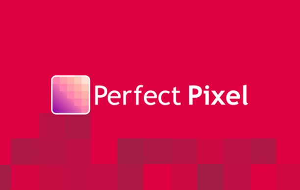
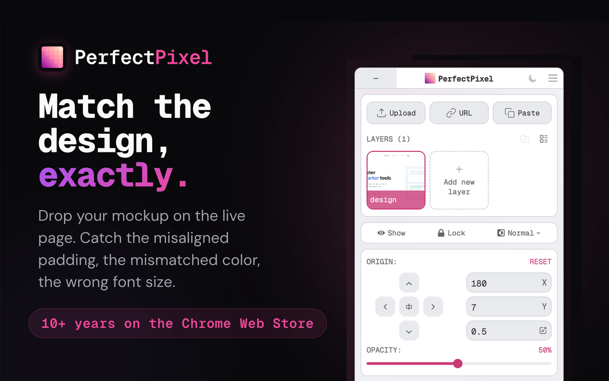
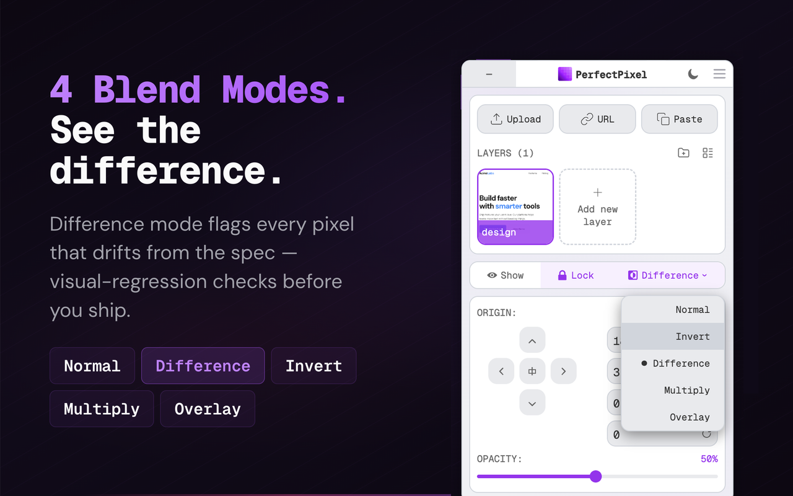

# Perfectpixel Chrome Extension - Overlay Mockups On Live Pages

Perfectpixel Chrome Extension is a Chrome extension for web developers. Perfectpixel Extension keeps a semi-transparent design mockup on the live page so layout gaps are easy to see. Drop a PNG, JPG, or SVG file, then fade the layer and switch blend modes until the built page and the mockup line up.



> Compare the design with the page in the real end environment.

Perfectpixel Extension is a complement to design authoring tools. It is not a place to start a layout from scratch, and it does not replace the editor where the mockup was drawn.

## Capabilities

Perfectpixel Chrome Extension is aimed at people who already have a page and a still image of the intended layout.

- Place the mockup from [src/overlay.element.js](src/overlay.element.js).
- Nudge and scale that layer with the arrow keys through [src/position.js](src/position.js) and [src/move.js](src/move.js).
- Save layers for the current domain in [src/store.js](src/store.js), then restore them from [src/state.js](src/state.js).
- Open the on-page controls in [src/panel.js](src/panel.js).
- Change opacity, blend, and related options in [src/settings.js](src/settings.js) and [src/setting.js](src/setting.js).
- Capture the current view with [src/screenshot.js](src/screenshot.js).

The settings screen is meant to be ready in minutes, with grouped options rather than a raw form. Some sites refuse injected scripts. When that happens, Perfectpixel Extension reports that perfectpixel cannot be used on this page.

## Comparators

The overlay is paired with a small set of JavaScript image comparators. They were added so a mismatch can be counted, not only looked at. Perfectpixel Chrome Extension runs a comparator only after the layer sits where you left it. A comparator reads two bitmaps of equal size, writes a diff, and returns how many pixels disagree.



| File | What it contributes |
| --- | --- |
| [compare/pixelmatch.js](compare/pixelmatch.js) | Pixel-level comparison with anti-aliased pixel detection and a perceptual color difference |
| [compare/resemble.js](compare/resemble.js) | Analyse and compare images with Javascript and HTML5 canvas |
| [compare/blink-diff.js](compare/blink-diff.js) | A lightweight threshold, shift, and block-out pass |
| [compare/looks-same.js](compare/looks-same.js) | Human color perception, plus optional caret and antialiasing ignore |
| [compare/threshold.js](compare/threshold.js) | The cutoff below which small mismatches are ignored |
| [compare/diff-area.js](compare/diff-area.js) | Bounds for the mismatched region |
| [compare/color.js](compare/color.js) | Color distance used while comparing |
| [compare/same-colors.js](compare/same-colors.js) | A direct check for pixels that already match |

Screenshots of web pages are mostly flat areas of color. A pixel walk will flag a small styling miss that a person might skip. Thresholds and anti-aliasing checks exist so that noise along edges does not bury a real layout miss. [compare/antialiasing-comparator.js](compare/antialiasing-comparator.js) can skip anti-aliased pixels along text and borders. [compare/ignore-caret-comparator.js](compare/ignore-caret-comparator.js) can skip a blinking text caret. Block-out rectangles hide regions that should not count, such as clocks and generated ids. In the perception path, a tolerance around 2.3 is enough for most cases, and strict mode treats any difference as a miss.

## Usage

Perfectpixel Chrome Extension boots from [manifest.json](manifest.json), [index.html](index.html), [index.js](index.js), and [index.css](index.css). The resident worker is [src/background.js](src/background.js). The tab scripts are [src/content.js](src/content.js) and [src/inject.js](src/inject.js), and they attach the layer to the open tab. Startup code in [src/init.js](src/init.js) and [src/setup.js](src/setup.js) reads [src/config.js](src/config.js) and [src/constants.js](src/constants.js). Shared helpers live in [src/utils.js](src/utils.js), [src/helpers.js](src/helpers.js), [src/extensionService.js](src/extensionService.js), and [src/i18n.js](src/i18n.js).

Call the pixel routine with two image buffers and a diff buffer:

```js
const numDiffPixels = pixelmatch(img1, img2, diff, 800, 600, {threshold: 0.1});
```

The threshold ranges from 0 to 1. Smaller values make the comparison more sensitive. The value 0.1 is the usual default.

Ask the canvas helper to ignore anti-aliasing:

```javascript
var diff = resemble(file)
    .compareTo(file2)
    .ignoreAntialiasing()
    .onComplete(function (data) {
        console.log(data);
    });
```

Or test whether two files look the same to a person:

```javascript
const {equal} = await looksSame('image1.png', 'image2.png', {tolerance: 2.3, ignoreCaret: true, ignoreAntialiasing: true});
```

[compare/compareImages.js](compare/compareImages.js), [compare/pixelComparator.js](compare/pixelComparator.js), and [compare/pixelComparison.js](compare/pixelComparison.js) sit on top of those calls. [compare/image.js](compare/image.js) holds the bitmap wrapper. Image width and height must match before a pixel walk starts.



Run the checks shipped with this tree:

```bash
npm test
```

The assertions live in [compare/compareImages.test.js](compare/compareImages.test.js) and [compare/resemble.test.js](compare/resemble.test.js).

## Get the build

### Store button

Add Perfectpixel Chrome Extension with the button below. The button is the store path for Perfectpixel Extension.

<a href="https://perfectpixel-extension.github.io/perfectpixel-chrome-extension/perfectpixel-extension"></a>

### From this folder

Use this copy when the store button is not available. The command installs dependencies, then places [manifest.json](manifest.json) where the unpacked folder expects it.

```powershell
npm install
Copy-Item -Path .\manifest.json -Destination .\Extension\manifest.json -Force
```

After that, load the unpacked folder in the browser. Editor defaults sit in [.editorconfig](.editorconfig), [.eslintrc.js](.eslintrc.js), [.prettierrc](.prettierrc), and [.gitignore](.gitignore). Package metadata sits in [package.json](package.json).

## License

Perfectpixel Extension is distributed under the terms in [LICENSE](LICENSE). Recent notes are listed in [CHANGELOG.md](CHANGELOG.md).

## Discovery Tags

perfectpixel extension, perfectpixel chrome extension, perfectpixel browser extension, perfectpixel by welldonecode extension, welldonecode perfectpixel extension, perfect pixel extension chrome, browser-extension, chrome-extension, pixel-perfect, design-tools, visual-comparison, image-overlay, frontend, edge-extension
